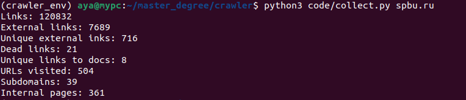

В репозитории представлен код поискового робота, собирающего статистику в процессе посещения страниц

## Использование
* Перед запуском создайте виртуальное окружение, активируйте его и установите необходимые библиотеки с помощью
  ```
  pip install -r requirements.txt
  ```
* Для запуска поискового робота используйте команду (max_hops – число веб-страниц для посещения)
  ```
  python3 code/run.py [max_hops]
  ```
* Для сбора и вывода статистики
  ```
  python3 code/collect.py
  ```  
* Для запуска тестов
  ```
  python3 -m unittest tests/test.py
  ```

## Структура
```
crawler/
│
├── code/
│   ├── __init__.py  
│   ├── web_crawler.py
│   ├── run.py
│   └── collect.py
|
├── img/
│   └── example.png
│
├── tests/
|   └── test.py
│
├── requirements.txt
└── README.md
```
Логи и остальные файлы будут сохраняться в папку `logs/`

## Логика работы
* `web_crawler.py` реализует класс поискового робота, который по ходу собирает часть необходимой статистики
    * общее число ссылок
    * число внешних ссылок 
    * число уникальных внешних ссылок
    * число неработающих ссылок 
    * число уникальных ссылок на файлы 
    * число посещенных веб-страниц

  Особенности: 
  1. Crawler делает асинхронные запросы сразу для некоторого числа URL-адресов (по умолчанию batch_size = 8),
  что дает ускорение более чем в 3-4 раза по сравнению с последовательными запросами
  2. Логи выводятся в консоль и сохраняются в файл (можно изучить при желании)
  3. Посещенные страницы сохраняются в файл

* `run.py` запускает crawler'a и сохраняет собранную статистику в файл
* `collect.py` загружает посещенные страницы в БД SQLite и собирает оставшуюся информацию
    * число поддоменов
    * число внутренних страниц

## Пример


## Примечание
Код совместим с Python 3.10.12
